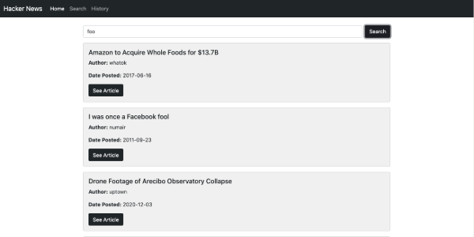
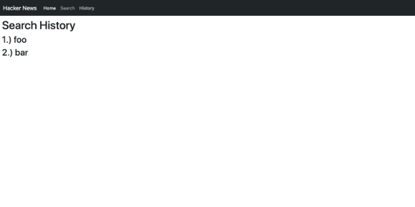

# Hacker News Search

This project is a simple search application that allows users to search Hacker News articles by keyword. It also saves your search history for a single session.

## API Reference

Hacker News Algolia API:

```http
https://hn.algolia.com/api
```

Each user `search` sends a request to the following url:

```http
  http://hn.algolia.com/api/v1/search?query={search}
```

The response should look like the following:

```json
{
  "hits": [
    {
      "created_at": "2017-06-16T13:03:09.000Z",
      "title": "Amazon to Acquire Whole Foods for $13.7B",
      "url": "https://www.bloomberg.com/news/articles/2017-06-16/amazon-to-buy-whole-foods?cmpid=socialflow-twitter-business&utm_content=business&utm_campaign=socialflow-organic&utm_source=twitter&utm_medium=social",
      "author": "whatok",
      "points": 1687,
      "story_text": null,
      "comment_text": null,
      "num_comments": 824,
      "story_id": null,
      "story_title": null,
      "story_url": null,
      "parent_id": null,
      "created_at_i": 1497618189,
      "relevancy_score": 7487,
      "_tags": [
        "story",
        "author_whatok",
        "story_14568468"
      ],
      "objectID": "14568468",
      "_highlightResult": {
        "title": {
          "value": "Amazon to Acquire Whole <em>Foo</em>ds for $13.7B",
          "matchLevel": "full",
          "fullyHighlighted": false,
          "matchedWords": [
            "foo"
          ]
        },
        "url": {
          "value": "https://www.bloomberg.com/news/articles/2017-06-16/amazon-to-buy-whole-<em>foo</em>ds?cmpid=socialflow-twitter-business&utm_content=business&utm_campaign=socialflow-organic&utm_source=twitter&utm_medium=social",
          "matchLevel": "full",
          "fullyHighlighted": false,
          "matchedWords": [
            "foo"
          ]
        },
        "author": {
          "value": "whatok",
          "matchLevel": "none",
          "matchedWords": []
        }
      }
    },
    // ...
```
  
## Screenshots

### /search



### /history


  
## Run Locally

Clone the project

```bash
  git clone https://github.com/meleciosilva/hacker-news-search.git
```

Go to the project directory

```bash
  cd hacker-news-search
```

Install dependencies

```bash
  npm install
```

Start the server

```bash
  npm run start
```

## Tech Stack

- **Client:** HTML, CSS, Boostrap, JavaScript, React, Bootstrap

## What I Learned

### Custom Hooks

- Custom hooks are used to encapsulate common hook-related logic that can easily be reused across components

### React's Context API / useContext Hook

- React's useContext hook is useful for passing data through an application without manually passing data via props
